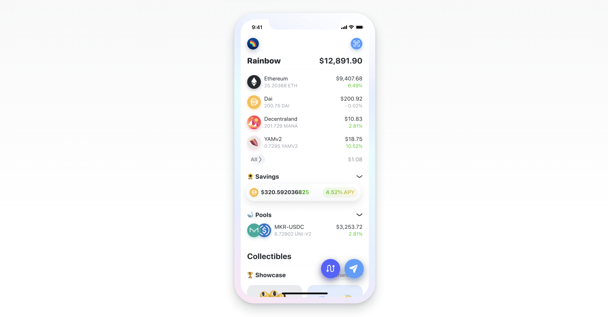
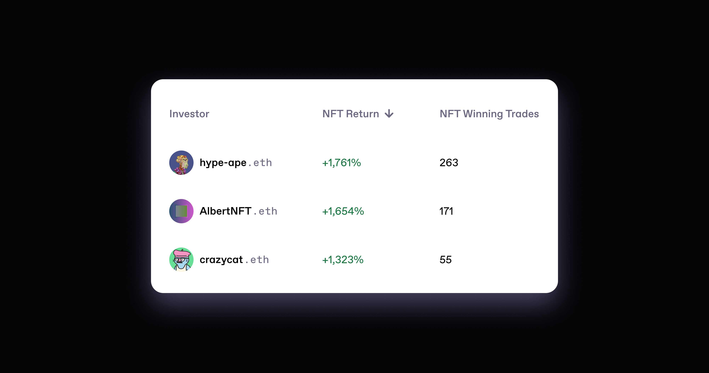

# Featured Partners

> **"At prysm.xyz, we use Zerion APIs for historical investing activity and current token ownership. **
>
> **Transactions are fast to query and include accurate fiat conversion rates, allowing our users to calculate comprehensive and accurate investing performance. The ability to create subscriptions on addresses allows us to follow wallets and update performance stats in near real time. Most importantly, the Zerion APIs scale to our need"**
>
> **                                                                   - **Stewart Bracken, Head of Blockchain Infrastructure at Prysm

## Rainbow Wallet

[Rainbow](https://rainbow.me) leverages Zerion's [Websocket API](websockets/getting-started/) to power the most simple non-custodial Ethereum wallet. Rainbow was our very first integration partner, and they have been using Zerion for more than a year now.

## Stake DAO

[Stake DAO](https://stakedao.org) uses [Zerion's API](websockets/getting-started/) to focus on what they do best: automated investment strategies.

.png>)

## DexGuru

[DexGuru](https://dex.guru) uses [Zerion's API](websockets/getting-started/) to support traders with real-time information about wallet balances for ERC20 and BEP20 tokens.

.png>)

## Prysm

[Prysm](https://www.prysm.xyz) uses [Zerion's API](websockets/getting-started/) for historical investing activity and current token ownership.&#x20;

Transactions are fast to query and include accurate fiat conversion rates, allowing their users to calculate comprehensive and accurate investing performance. The ability to create subscriptions on addresses allows them to follow wallets and update performance stats in near real time.

## DeFi Market Cap

[DeFi Market Cap](https://defimarketcap.io) features the top 100 DeFi tokens by market capitalization. It uses Zerion's [Websocket API](websockets/getting-started/) to fetch the prices and market capitalizations of DeFi assets in real-time.

.png>)

And many more, including:

* [https://open-orgs.info/](https://open-orgs.info)
* [https://prysm.xyz/](http://prysm.xyz)
* [https://mask.io/](https://mask.io)
* & more building right now ⚒️

## Infrastructure Partners

### Alchemy

Zerion is a proud user of [Alchemy](https://www.alchemy.com) - blockchain node infrastructure.&#x20;

### CoinGecko

We use [CoinGecko](https://www.coingecko.com) to find the most accurate price data for many of the assets on Zerion.&#x20;

.png>)
